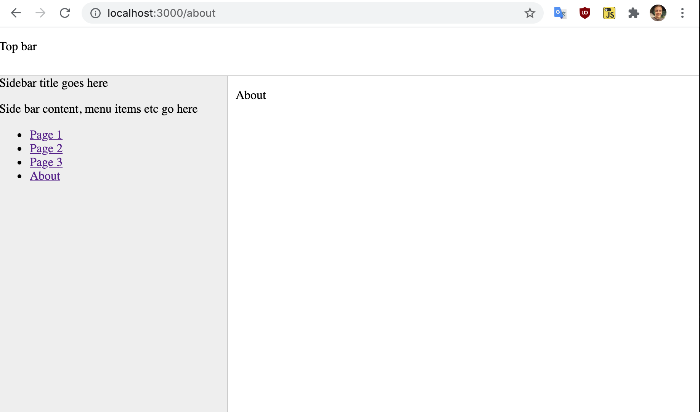
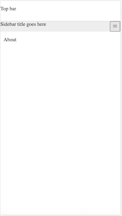

# React sidebar example

I've put this together as a quick demonstration for my students on how to create a sidebar using CSS and React without needing a UI framework that behaves in the following way:

* Full screen desktop browser: Sidebar is always visible.
* Mobile size screen: Sidebar becomes a column within the main document flow that has a show/hide button.

## Screen shot examples

Desktop with visible sidebar

Mobile with hidden menu

Mobile with visible menu

## Files to look at

To keep the example simple, all the relevant code is contained within

* [./src/App.css](./src/App.css)
* [./src/App.jsx](./src/App.jsx)

## License & author

MIT License
by Paul Baumgarten 2021

